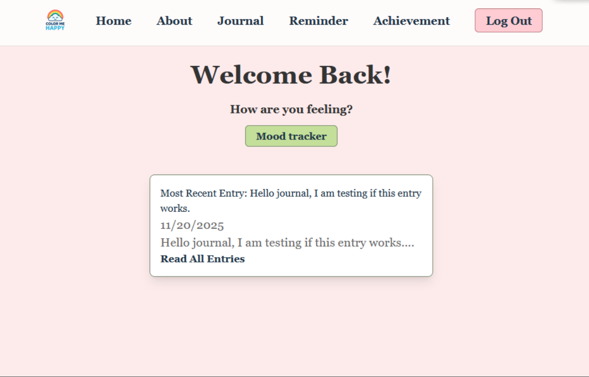
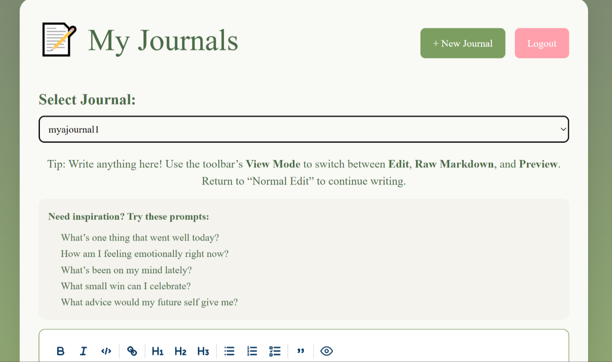
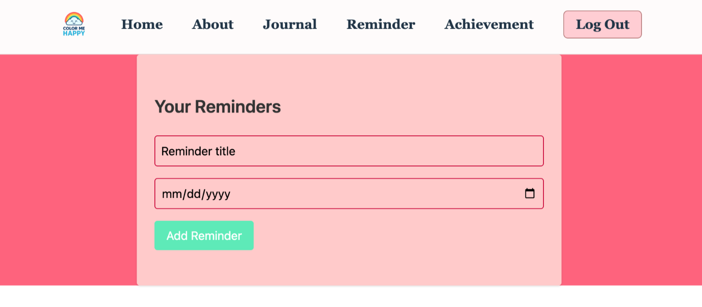
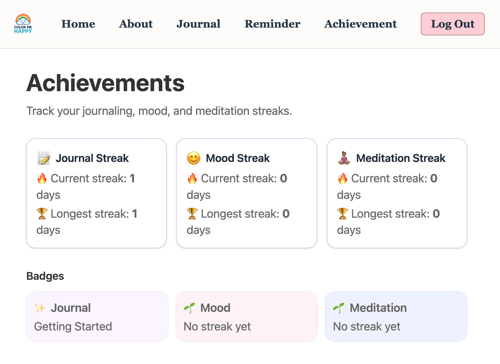

# Color Me Happy

Color Me Happy is a mindful journaling application with built-in mood tracking and a meditation timer 🧘🏽‍♀️. Users can journal as guests using local browser storage or create accounts with Supabase authentication.  

Built as part of The Knowledge House 2025 Capstone.

---

## Features

- Rich text journaling (headings, lists, bold, quotes, links)
- Mood selection with each entry
- Meditation timer with presets and optional audio
- Local storage for guest users
- Supabase authentication and storage for registered users
- Markdown Edit / Raw / Preview modes

---

## Tech Stack

- React (Vite)
- React Router v6
- Tailwind CSS
- Supabase Auth
- Local Storage (guest mode)
- Overtype dev (text-editor for Guest and Auth)
- Optional audio upload + external music links

---

## Color Palette
#F8DADA  Background
#F4EAF3  Soft Accent
#2F3141  Primary Text
#E6A5BD  Highlight
#E8D3F7  Meditation Panel
### Color inspiration for overall project

## Technologies / Credit
### Heroicons (Outline Set)
Color Me Happy uses **Heroicons Outline** for UI icons such as the **question mark icon** (Home page) and the **open-book icon** (Sign-Up & Login pages).  
Documentation & icons: https://heroicons.com/outline

### Overtype Editor
Color Me Happy uses the **Overtype rich-text editor** for journaling and markdown editing.  
Overtype provides Edit, Raw Markdown, and Preview modes for a smooth writing experience.

Documentation: https://overtype.dev  
CDN Script used inside `index.html`:

### Team Avatars created by Dominique Bullard
- Logo concept designed using AI-assisted tools.
---

## UI Previews
- Home Page
- Journal Page
- Meditation Timer
- Mood Tracker

---

## Setup

Create a `.env` file in the project root:

VITE_SUPABASE_URL=your_url_here
VITE_SUPABASE_ANON_KEY=your_key_here

---

Install and run:
npm install
npm run dev
npm install canvas-confetti

---

## Contributors

Developed by **The Knowledge House 2025 Web Development Cohort — Frontenders**  
- Mya Walker  
- Pauriany Segarra  
- Dominique Bullard  
- Elijah Reed  

---

## Credits
Icons used in this project are from [Heroicons](https://heroicons.com/), including:
- Question Mark Icon on Home Page
- Open Book Icon on Signup Page